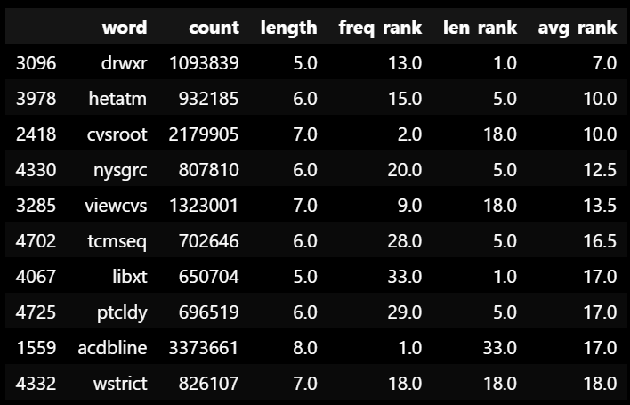

# Word Domains

This project checks if common words are available as domain names, using a publicly available dataset of words and a free Whois database search package. The results highlight the scarcity of available domain names, identify some potentially valuable domains, and show opportunities for future research.

## Methodology

The analysis uses the `python-whois` [module](https://pypi.org/project/python-whois/) and a Kaggle [dataset](https://www.kaggle.com/datasets/rtatman/english-word-frequency) derived from the Google Web Trillion Word Corpus.

### Available files

- [helper_functions.py](helper_functions.py) — Defines the functions that loop through possible words and check their corresponding domains against the Whois database.
- [dm_check.py](dm_check.py) — Imports the words dataset, performs some minor data manipulation, and runs the pipeline defined in `helper_functions.py`. Results are exported to CSV files in the [results](results) folder, one for each length of word checked.
- [domain_checker.ipynb](domain_checker.ipynb) — Jupyter Notebook that explains the process from the Python file, imports the results from CSV files, and tallies final results.
- [data/unigram_freq.csv](data/unigram_freq.csv) — the dataset of words and their frequency from the Google Corpus.

### Operation

Running the [dm_check.py](dm_check.py) file searches for domain registrations across a list of words, separated by word length in letters, then exports to CSV files. Because the file takes a long time to run, it was a priority that: 1) the file could be run easily from the command line, and 2) separate CSV files were created throughout the file running so that if an error occurred, some progress was saved.

Here's how to replicate the project after cloning this repository:

- From a command line interface in the word-domains directory, run `python dm_check.py 19 -e 20` as a test.
  - The words list contains words with lengths of 5 letters to 20 letters, and the command line arguments specify which lengths to check.
  - The file accepts 1 positional and 1 optional argument.
  - The first number is the start of the length range and is required. The value must be from 5 to 20.
  - `-e` is a shorthand for the `end_length` argument. Including `-e` and a number specifies an end of the length range. This is optional—without this argument, you will only search for 1 length of word.
  - i.e., in `python dm_check.py 19 -e 20`, the file will search through the domains for words with 19 and 20 letters. The results will be exported to the `results` folder as `dm_results_19_letters.csv` and `dm_results_20_letters.csv`.
- It's recommended to start with a short range as a test because the file takes a considerable amount of time to run. Then you can continue with larger ranges.
  - Personally, I continued to run in batches so that I could monitor the operation more closely.
  - However, you can theoretically run `python dm_check.py 5 -e 20` to run the entire pipeline at once. I would expect this to take several hours, but you can monitor progress in the CLI.
- After all the CSV files have been exported, open and run [domain_checker.ipynb](domain_checker.ipynb).
  - This Jupyter Notebook explains the process from the Python file, imports the results, and tallies final results.
  - The final result is a DataFrame of the top words with available domains, as ranked by how long they are and how commonly they are used.

## Results

The results show that there are many terms that aren't just words. They may be amalgamations of words or (relatively) common abbreviations. Many of these "words" are computer commands, which would explain why they were indexed so highly in the Google web corpus. There also appear to be some combined words that could be hashtags from sites like Pinterest.

A composite ranking for each word with an available domain was calculated. This composite was an average of the word's rankings in length and frequency—lower is better. A preview of results is shown below:

## Takeaways

The dearth of available domains that are actually words isn't totally surprising, but the sparcity is still striking to me. However, this project did uncover what I believe to be some high-value domain names.

There are also significant opportunities for further research:

- Testing other TLDs could find many more available domains.
  - This only tested `.com` TLDs, but the `python-whois` package states that it supports `.net` and `.edu` as well.
  - I also believe that it supports `.org` and other TLDs and that their error messages just haven't been updated to reflect that.
- Previous research suggested that all 4-letter domains (words or otherwise) had been registered. However, this project would suggest that there are 5-letter domains, even relatively popular abbreviations.
  - Theoretically, it wouldn't be too complicated to use the functions defined in this project to search through all possible 5-letter combinations.
  - Practically, that's 26^5 possibilities. When running the pipeline without anything else running on my computer, I could get through about 3,000 domains per hour.
  - If we generously believe that pace could be maintained for a much larger volume, then the 11,881,376 possibilities (minus the near negligble number already tested as words) would take approximately 3,960 hours. So if it was constantly running on my local machine, it would take about 165 days. Maybe there are cloud computing solutions, but this idea may need to stay theoretical for the sake of cost.
- Other corpora could be used to specifically target full words, not including abbreviations or amalgamations.
  - Other corpora considered were the Corpus of Contemporary American English (COCA) and the iWeb corpus.
  - However, I didn't want to spend hundreds of dollars on a corpus. An academic license could ease this if you're part of an eligible academic institution.

Overall, this project was a fun exercise with some interesting conclusions. I don't expect the results to be accurate for long though—someone will snap up these domains soon enough.
